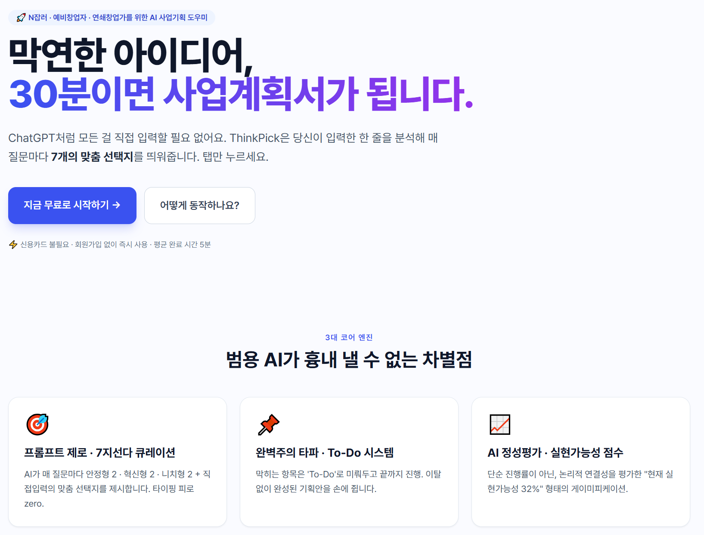
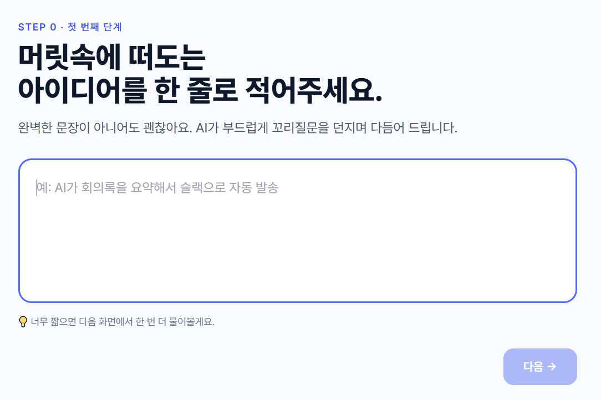
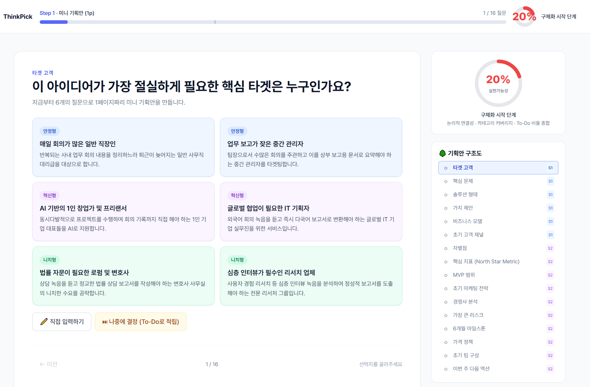
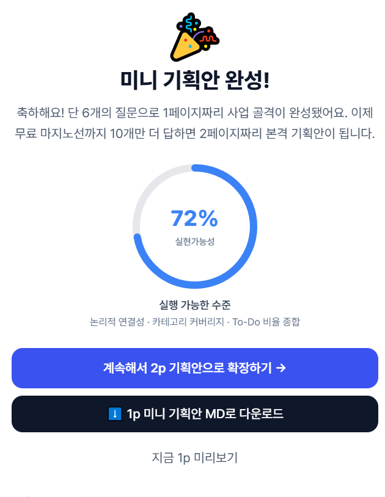
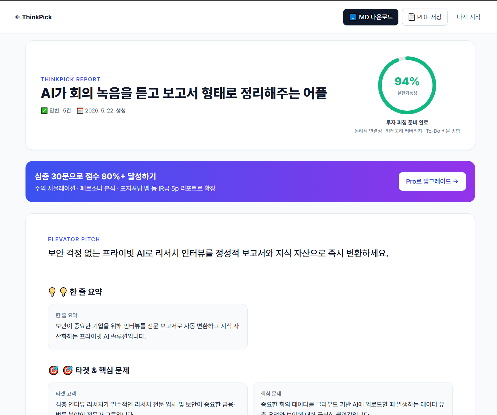

# 🚀 ThinkPick (씽크픽)

> **"막연한 아이디어 → 30분 만에 완성되는 실현 가능한 사업계획서"**
> 
> ChatGPT처럼 모든 내용을 직접 입력할 필요가 없습니다. 사용자가 적어준 한 줄의 아이디어를 바탕으로, AI가 정밀 분석하여 단계마다 **7개의 맞춤형 선택지**를 큐레이션합니다. 탭(Tap) 몇 번으로 완성도 높은 린(Lean) 스타트업 기획안을 도출하세요!

---

## 📸 서비스 미리보기

### 🎯 메인 랜딩 페이지 (Hero)


---

## ⚙️ 3대 핵심 코어 엔진 (Core Engine)

1. **프롬프트 제로 (Zero-Prompt) & 7지 선다형 큐레이션**
   - 타이핑 피로감을 극도로 낮추기 위해, AI가 이전 맥락을 파악하고 안정형(2) · 혁신형(2) · 니치형(2) + 직접 입력의 7지 선다 맞춤 선택지를 제공합니다.
2. **완벽주의 타파 'To-Do 리스트' 시스템**
   - 당장 결정하기 어렵거나 막히는 질문은 'To-Do'로 넘겨두고 뒤로 미룰 수 있어 이탈(Drop-off) 없이 기획안을 끝까지 완성할 수 있습니다.
3. **AI 정성 평가 기반의 '구현 가능성 점수' (Feasibility Score)**
   - 단순 진행률(%)이 아닙니다. 비즈니스 모델, 타겟층, 수익성 등 각 요소의 유기적인 논리 구조를 AI가 실시간 평가하여 "현재 사업 실현 가능성 32%" 형태로 점수화 및 게이미피케이션 요소를 가미했습니다.

---

## 🌊 사용자 경험 흐름 (UX Flow)

### 1️⃣ STEP 0. 온보딩 및 아이디어 구체화 (재료 수집)
- 초기 한 줄 아이디어를 입력하면 AI가 맥락을 분석하고 더 풍부한 기획을 위해 스마트한 꼬리질문(Follow-up)을 제공합니다.



### 2️⃣ STEP 1. 미니 기획안 작성 (1p 분량)
- 린 스타트업 기반의 핵심 6개 질문에 7지선다 선택지를 골라가며 빠르게 뼈대를 구축합니다.
- 완료 시 즉시 다운로드 가능한 **1p 미니 기획안**을 생성해 드립니다.




### 3️⃣ STEP 2. 기획안 확장 (2p 분량 / 무료 제공)
- 10개의 추가 질문을 해결하여 전체적인 사업의 숲(구조도)을 시각화합니다.
- 깊이 있는 시장 리스크 및 구체적인 사업 실행 계획 구조를 시각적으로 한눈에 파악할 수 있습니다.



---

## 🛠️ 기술 스택 (Tech Stack)

- **Core:** Next.js 14 (App Router)
- **Styling:** Tailwind CSS (Vanilla styling)
- **State Management:** Zustand (with LocalStorage Persistence)
- **AI Integration:** Gemini API (실시간 JSON 구조화 출력 및 Google Search 그라운딩 기반 시장 조사)
- **Language:** TypeScript

---

## 🚀 시작하기 (How to Run)

### 1. 패키지 설치
```bash
npm install
```

### 2. 개발 서버 실행
```bash
npm run dev
# http://localhost:3000 으로 접속합니다.
```

### 3. 프로덕션 빌드 및 타입 체크
```bash
npm run build
```

---

## 📂 프로젝트 구조 (Architecture)

- `src/app/` — 라우팅 및 개별 페이지 뷰 (`onboard/`, `plan/`, `report/`)
- `src/components/` — UI 공통 컴포넌트 (`QuestionCard.tsx`, `FeasibilityScore.tsx` 등)
- `src/lib/llm/` — **서버 전용** Gemini API 통신 레이어 (`import "server-only"` 가드로 API 키 안전 보호)
- `src/lib/store.ts` — Zustand 영속성 전역 상태 관리
- `src/lib/scoring.ts` — 구현 가능성 가중치 휴리스틱 점수 연산 로직
- `src/lib/reportBuilder.ts` — 마크다운(MD) 리포트 다운로드 빌더

---
© 2026 ThinkPick · N잡러와 예비 창업자를 위한 AI 사업 기획 파트너
